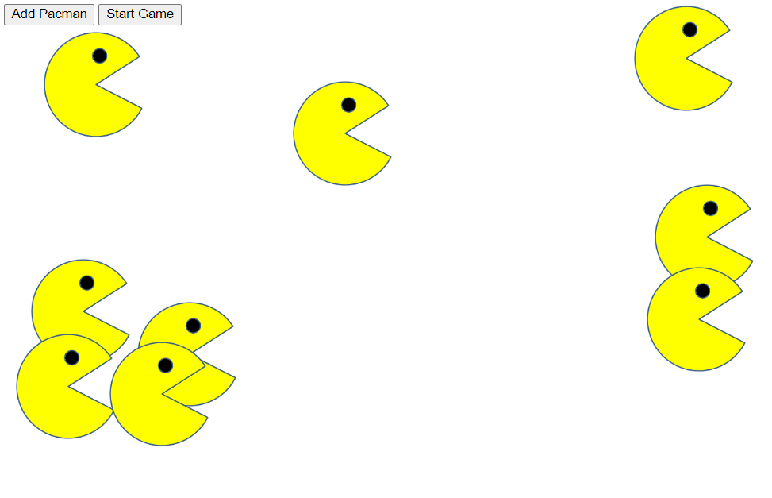

# PacMen
## Exercise to Add Moving PacMen

This web page produces a PacMan each time a button is clicked by using array methods and by manipulating the DOM. Multiple PacMen can be created that randomly move back and forth across the browser window. This exercise demonstrates my ability to use Javascript to dynamically display data on a page.
  
To run this on your machine, you'll need all of these files and you'll need to load the .html file onto your browser.
  
Additional functionality that would be helpful to a user for future iterations would be to add a reset or stop button to be able to start over again without having to refresh the page.
